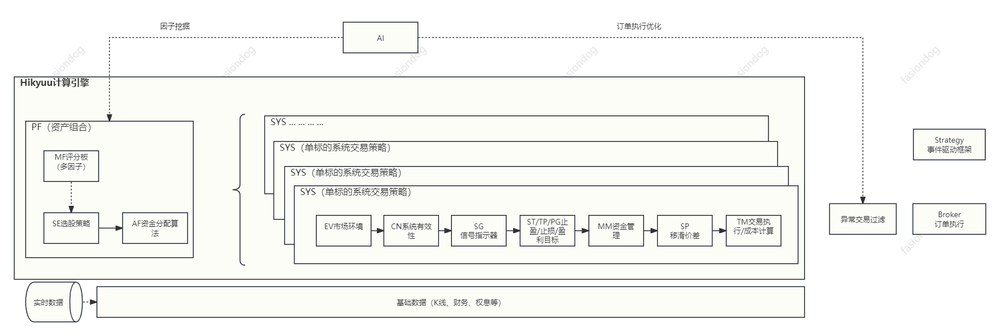

<p align="center">
  
</p>

<p align="center">
  基于 C++/Python 的开源超高速量化交易研究框架，聚焦策略分析与回测
</p>

<p align="center">
  
  
  
  
</p>

<p align="center">
  <a href="readme.md">English</a> | <b>简体中文</b>
</p>

Hikyuu Quant Framework 依托成熟的系统化交易与投资组合理念，核心目标聚焦于打造策略(或资产)组合的快速策略研究体系，同时将量化分析体系拆解为市场环境、信号、止损 / 止盈、资金管理、收益目标、滑点、多因子、资金分配等可独立替换的**策略部件**，自由组合即可搭建专属策略库，并通过回测验证有效性。

> ⚠️ **免责声明**：本项目为开源金融技术研究工具，仅供个人学习、学术研究与数据分析使用，不构成任何投资建议与交易指导，不提供、不内置证券交易服务。用户自主新增、对接各类交易接口、开发拓展功能以及对应的实操行为，均由用户自行承担全部风险与法律责任，严禁对接非法交易通道、用于违规交易场景。

---

## 📊 关键数据

<p align="center">
  <table>
    <tr>
      <td align="center" width="33%">
        <strong><code>⚡ 166ms</code></strong><br>
        <sub>预热后 1913 万 K 线求和耗时（AMD 7950x）</sub>
      </td>
      <td align="center" width="33%">
        <strong><code>🧩 10+</code></strong><br>
        <sub>核心策略部件 · 自由组合构建资产库</sub>
      </td>
      <td align="center" width="33%">
        <strong><code>💾 4 种</code></strong><br>
        <sub>存储方式（HDF5 / MySQL / ClickHouse / SQLite）</sub>
      </td>
    </tr>
  </table>
</p>

---

## 🔗 快速导航

| 项目                   | 链接                                                                                                                                              |
| ---------------------- | ------------------------------------------------------------------------------------------------------------------------------------------------- |
| 🏠**项目首页**   | [https://hikyuu.org/](https://hikyuu.org/)                                                                                                         |
| 📚**帮助文档**   | [https://hikyuu.readthedocs.io/zh-cn/latest/index.html](https://hikyuu.readthedocs.io/zh-cn/latest/index.html)                                     |
| 🚀**入门示例**   | [Jupyter Notebook 系列教程](https://nbviewer.org/github/fasiondog/hikyuu/blob/master/hikyuu/examples/notebook/zh/000-Index.ipynb?flush_cache=True) |
| 🧰**策略部件库** | [https://gitee.com/fasiondog/hikyuu_hub](https://gitee.com/fasiondog/hikyuu_hub)                                                                   |

---

## ⚡ 快速开始（跑通第一个回测）

### 环境要求

- **Python 3.10+**（3.9 及以下自 2.8.0 起不再支持 pip 安装）
- 支持 Windows / Linux / macOS（Linux 需 Ubuntu 24.04+）
- 主要依赖自动安装：`numpy`、`pandas`、`matplotlib`、`PySide6`、`tables` 等

### 第 1 步：安装

```bash
pip install hikyuu
```

国内用户若下载缓慢，可换用镜像源：

```bash
pip install hikyuu -i https://pypi.tuna.tsinghua.edu.cn/simple
```

### 第 2 步：导入行情数据

任选一种方式导入 A 股历史行情数据：

```bash
# 图形界面（推荐首次使用，会自动生成配置文件）
HikyuuTDX

# 命令行（需先运行过一次 HikyuuTDX 生成配置）
importdata
```

> ℹ️ **数据范围说明**：HikyuuTDX 目前仅支持下载**国内 A 股**历史数据，首次使用需在图形界面中完成初始配置；美股等其他市场暂不支持，后续将逐步补充。

### 第 3 步：跑通第一个回测

```python
from hikyuu.interactive import *

# 创建模拟交易账户进行回测，初始资金 30 万
my_tm = crtTM(init_cash=300000)

# 创建信号指示器（以 5 日 EMA 为快线，其 10 日 EMA 为慢线）
# 快线向上穿越慢线时买入，反之卖出
my_sg = SG_Flex(EMA(CLOSE(), n=5), slow_n=10)

# 固定每次买入 1000 股
my_mm = MM_FixedCount(1000)

# 创建交易系统并运行
sys = SYS_Simple(tm=my_tm, sg=my_sg, mm=my_mm)
sys.run(sm['sz000001'], Query(-150))
```

<p align="center">
  
</p>

> 📖 完整示例参见 [Jupyter Notebook 系列教程](https://nbviewer.org/github/fasiondog/hikyuu/blob/master/hikyuu/examples/notebook/zh/000-Index.ipynb?flush_cache=True)

### ❓ 上手常见问题

| 现象                                              | 解决办法                                                                     |
| :------------------------------------------------ | :--------------------------------------------------------------------------- |
| Windows 下`pip install` 卡在下载 PyQt / PySide6 | 换清华源：`pip install hikyuu -i https://pypi.tuna.tsinghua.edu.cn/simple` |
| `HikyuuTDX` 图形界面无法导入数据                | 改用命令行`importdata`（需先运行过一次 GUI 以生成配置文件）                |
| 提示缺少 hdf5 / dll 相关错误                      | 执行`pip install tables` 重新安装 HDF5 支持                                |
| **从源码构建**时的构建工具                  | 本项目使用**xmake**，不是 cmake                                        |

> 💡 更多问题请查 [帮助文档](https://hikyuu.readthedocs.io/zh-cn/latest/index.html)，或在 [Gitee 提交 issue](https://gitee.com/fasiondog/hikyuu/issues)。

---

## 🚀 为什么选择 Hikyuu？

> 强大的功能特性，助力您的量化交易研究

### 💹 组合灵活，分类构建策略资产库

对系统化交易方法进行轻量化抽象，将市场环境、信号指示器、止损 / 止盈、资金管理、盈利目标、滑点、资金分配等封装为可独立替换的**策略部件**。你可以自由组合、高效回测，并在研究时专注于单一部件的效果与影响。完整部件清单见下文「交易系统化架构核心部件」。

<p align="center">
  
</p>

### 🚀 极致性能，轻松构建专属量化应用

项目由三大部分构成：**高性能 C++ 核心库**、**Python 接口层（hikyuu）** 以及 **交互式探索工具**。

- **AMD 7950x 实测**：A 股全市场 1913 万日 K 线，首次加载并计算 20 日均线求和仅需 **6 秒**，数据预热后同操作仅需 **166 毫秒**（[📊 性能实测详情](https://mp.weixin.qq.com/s?__biz=MzkwMzY1NzYxMA==&mid=2247483768&idx=1&sn=33e40aa9633857fa7b4c7ded51c95ae7)）。
- **C++ 核心库**：内置完整策略框架，原生支持多线程与多核加速，为超高算力场景预留扩展空间；核心库可独立剥离使用，帮助开发者快速构建自定义量化工具。
- **Python 接口层（hikyuu）**：对 C++ 核心进行轻量化封装，集成 TA-Lib，支持与 numpy、pandas 无缝互转，轻松对接主流 Python 数据分析生态。
- **hikyuu.interactive**：交互式探索工具，内置 K 线、指标、信号可视化能力，适合快速策略验证与回测分析。

### 🍳 语法简洁，策略探索更高效自由

同时支持 **面向对象** 与 **命令行** 两种编程范式。尤其在策略探索阶段，命令行风格语法极简、表达直观，让你更快验证想法、迭代策略。

### 🔐 自主可控，搭建专属云量化平台

结合 **Python + Jupyter** 与云服务器，即可搭建完全自主可控的云量化平台。部署后随时随地访问（手机、平板、电脑均可使用），快速落地新想法。同时可无缝对接 **numpy、scipy、pandas、TensorFlow** 等成熟 AI 与数据分析工具，构建智能量化系统。也可按需自定义界面、实现服务化部署。

### 🎁 模块化可扩展数据存储

目前支持 **HDF5、MySQL、ClickHouse、SQLite** 四种存储方式，默认采用 HDF5（体积小、读写快、备份便捷）。通过插件可扩展 ClickHouse，读写速度优于 HDF5、空间占用远低于 MySQL，更适配分钟级及以下粒度的高频数据。

### 💻 简洁的 API 设计

几行代码即可搭建完整的策略回测系统，直观的 API 让策略开发更高效。

### 🔓 开源透明，数据安全可控

**Apache 2.0** 开源协议，代码透明审计无忧。核心数据、策略全量本地可控，C++ 核心库可独立剥离使用，自由打造专属客户端工具，无需担心第三方平台限制，但请遵循协议。

---

## 🏗️ 交易系统化架构核心部件

> 遵循系统化交易理念严谨架构，每个部件可独立替换、自由组合

| 层级                   | 部件                           | 说明                           |
| :--------------------- | :----------------------------- | :----------------------------- |
| **投资组合层**   | `Portfolio / PF`             | 投资组合：多系统的策略调度     |
|                        | `Selector / SE`              | 系统对象选择：系统策略筛选     |
|                        | `AllocateFunds / AF`         | 资金分配：多系统的资金分配     |
|                        | `MultiFactor / MF`           | 多因子模型：因子评分与排序     |
| **交易系统 SYS** | `Environment / EV`           | 市场环境：大盘环境有效性判断   |
|                        | `Condition / CN`             | 系统有效条件：系统适用条件     |
|                        | `Signal / SG`                | 信号指示器：产生买卖信号       |
|                        | `Stoploss / Stopprofit / ST` | 止损 / 止盈：风险控制退出      |
|                        | `MoneyManager / MM`          | 资金管理：买卖数量控制         |
|                        | `ProfitGoal / PG`            | 盈利目标：目标达成退出         |
|                        | `Slippage / SP`              | 滑点：回测价格模拟             |
| **交易管理**     | `TradeManager / TM`          | 交易管理：账户资金与持仓记录   |
|                        | `OrderBroker / OB`           | 订单执行：实盘下单 broker 对接 |
| **数据层**       | `StockManager`               | 证券统一管理                   |
|                        | `KData`                      | K 线量价序列                   |
|                        | `Query`                      | 时间范围查询筛选               |

---

## 📂 浏览源码

> 欢迎 **Star ⭐**，参与贡献

| 平台                 | 链接                                                                      | 推荐        |
| :------------------- | :------------------------------------------------------------------------ | :---------- |
| **GitHub**     | [https://github.com/fasiondog/hikyuu](https://github.com/fasiondog/hikyuu) | 海外        |
| **码云 Gitee** | [https://gitee.com/fasiondog/hikyuu](https://gitee.com/fasiondog/hikyuu)   | ✅ 国内推荐 |
| **GitCode**    | [https://gitcode.com/hikyuu/hikyuu](https://gitcode.com/hikyuu/hikyuu)     | ✅ 国内推荐 |

---

## ❤️ 感谢捐赠，让 Hikyuu 走得更远

| 方案                       | 说明                                                                                                                     | 方式                | 链接                                   |
| :------------------------- | :----------------------------------------------------------------------------------------------------------------------- | :------------------ | :------------------------------------- |
| ☕**请作者喝杯咖啡** | ¥30 · 一次性的小小支持（赠历史日线及 3 个月捐赠权益）                                                                  | 支付宝              | [前往捐赠](https://wzyp.cn/item/gflv3v) |
| 📅**订阅 180 天**    | ¥50 · 半年期捐赠权益（赠历史日线）                                                                                     | 支付宝              | [前往捐赠](https://wzyp.cn/item/du4h8s) |
| 🗓️**订阅 365 天**  | ¥100 · 全年期捐赠权益（赠历史日 / 分 / 时 / 笔数据）                                                                   | 支付宝              | [前往捐赠](https://wzyp.cn/item/ehbz9b) |
| 🌌**加入知识星球**   | ¥300/年 · 首年 300 元，续费半价；捐赠权益 1 年可 3 台设备登录 · 专属微信群及策略部件库（赠历史日 / 分 / 时 / 笔数据） | 微信 / 知识星球 APP | [前往加入](https://t.zsxq.com/YSATD)    |

> 🎁 **捐赠计划与附赠详见**：[https://hikyuu.readthedocs.io/zh-cn/latest/vip/donate-plan.html](https://hikyuu.readthedocs.io/zh-cn/latest/vip/donate-plan.html)

捐赠用户支持群（仅接受捐赠用户，入群请注明：Hikyuu 订阅）

<p align="center">
  
</p>

---

## 🌟 需要的帮助

欢迎社区成员一起参与贡献：

- 🐛 测试并反馈 Bug
- 📝 编写文档
- 🔧 开发新功能
- 🎨 网站优化

> 💡 **建议通过在 GitHub / Gitee / GitCode 开 issue 的方式贡献以上内容**

---

## 📦 项目依赖说明

C++ 核心模块直接依赖的开源项目、项目地址及 License 已汇总至 [THIRD_PARTY_LICENSES.md](THIRD_PARTY_LICENSES.md)（间接依赖未列出），在此向所有开源作者致敬 👍

Python 侧依赖见 [requirements.txt](requirements.txt)。

---

## Star History

<a href="https://www.star-history.com/?repos=fasiondog%2Fhikyuu&type=date&legend=top-left">
 <picture>
   <source media="(prefers-color-scheme: dark)" srcset="https://api.star-history.com/chart?repos=fasiondog/hikyuu&type=date&theme=dark&legend=top-left" />
   <source media="(prefers-color-scheme: light)" srcset="https://api.star-history.com/chart?repos=fasiondog/hikyuu&type=date&legend=top-left" />
   
 </picture>
</a>
